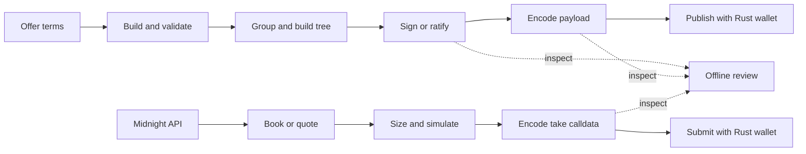

<p align="center">
  <a href="https://github.com/Oliverpt-1/Nocturne/actions/workflows/ci.yml"></a>
  <a href="#license"></a>
  <a href="https://t.me/+tc58eLgH-dU1ZTJh"></a>
</p>

<p align="center"><em>A complete Rust integration path for Morpho Midnight offers.</em></p>

<p align="center">
  <a href="crates/nocturne/README.md">SDK Guide</a> |
  <a href="https://docs.rs/nocturne-midnight">API Docs</a> |
  <a href="crates/nocturne/examples/README.md">Examples</a> |
  <a href="crates/nocturne-verify/README.md">CLI Guide</a>
</p>

<p align="center">
  
</p>

## What is Nocturne?

Nocturne is a Rust SDK for integrating with the
[Morpho Midnight](https://github.com/morpho-org/midnight) protocol. It builds and signs offers,
constructs Merkle trees, simulates execution, reads the public order book, encodes calldata and
mempool payloads, and produces transactions that Rust wallet clients can submit.

## Status

Nocturne is an early v0.1.0 release and has not been independently security-audited. See
[SECURITY.md](SECURITY.md) before using it with real value.

## Install

The crates.io package and Rust import intentionally have different names:

| Context | Name |
|---|---|
| crates.io SDK package | `nocturne-midnight` |
| Rust import | `nocturne` |

Add the SDK to a Rust application:

```toml
[dependencies]
nocturne = { package = "nocturne-midnight", version = "0.1.0" }
```

Install the CLI:

```sh
cargo install nocturne-verify
```

## Complete flows



- **Maker:** build → validate → group → sign or ratify → encode → publish.
- **Taker:** fetch → quote → size → simulate → encode → submit.
- **Reviewer:** receive bytes or typed data → decode → reproduce root and digest → verify.

Start with the [SDK quickstart and complete workflows](crates/nocturne/README.md). Every example and
its exact Cargo command are listed in the [examples index](crates/nocturne/examples/README.md).
CLI commands are documented in the [CLI guide](crates/nocturne-verify/README.md).

## Development and verification

The minimum supported Rust version is 1.90. Run the repository checks with:

```sh
cargo test --workspace --all-targets
```

Protocol-critical outputs have contract and TypeScript SDK parity coverage. The maintainer-only
[live Anvil harness](crates/nocturne/e2e/README.md) exercises complete maker, taker, authorization,
cancel-and-replace, state-decoding, and market-making lifecycles against deployed Midnight
contracts.

## Getting help

- Join the [Telegram chat](https://t.me/+tc58eLgH-dU1ZTJh) for questions and discussion.
- Open a [GitHub issue](https://github.com/Oliverpt-1/Nocturne/issues) for bugs and features.
- Report vulnerabilities privately using [SECURITY.md](SECURITY.md).

## Acknowledgements

- [Morpho SDKs](https://github.com/morpho-org/sdks) and
  [Morpho Midnight](https://github.com/morpho-org/midnight) — protocol behavior, compatibility
  vectors, and selected algorithms were developed with reference to these public projects.
- [ruint](https://github.com/recmo/uint) / [alloy](https://github.com/alloy-rs) — Ethereum
  primitives and optional wallet integration.
- [RustCrypto `k256`](https://github.com/RustCrypto/elliptic-curves) — secp256k1 signing and
  recovery.
- [`tiny-keccak`](https://github.com/debris/tiny-keccak), [`rayon`](https://github.com/rayon-rs/rayon),
  and [Foundry](https://github.com/foundry-rs/foundry).

## Disclaimer

Independent, personal open source project—not created, endorsed, or supported by Morpho.
Provided "AS IS" with no warranty and no liability, and it is not financial, investment, or legal
advice. Interacting with blockchain protocols and automated trading carries significant risk,
including total loss of funds. See [DISCLAIMER.md](DISCLAIMER.md) for the full text.

## License

Licensed under either of [Apache License, Version 2.0](LICENSE-APACHE) or
[MIT license](LICENSE-MIT) at your option.
