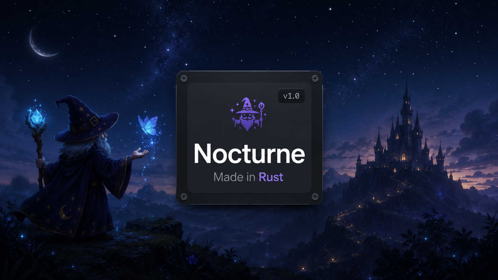

<p align="center">
  <a href="https://github.com/Oliverpt-1/midnight-rust/actions/workflows/ci.yml"></a>
  <a href="#license"></a>
  <a href="https://t.me/+tc58eLgH-dU1ZTJh"></a>
</p>

<p align="center"><em>Fast off-chain signing and offers for the Morpho Midnight protocol.</em></p>

<p align="center">
  
</p>

## What is Nocturne?

**Nocturne** is a high-performance Rust library for building, signing, validating, and executing
offers on the [Morpho Midnight](https://github.com/morpho-org/midnight) protocol.

Designed for market makers, trading firms, integrators, and protocol developers, Nocturne provides
the off-chain infrastructure needed to quote markets, generate Merkle trees, sign offers, simulate
execution, and interact with Midnight with minimal latency. While Midnight settles credit onchain,
offers are created and managed offchain, where Nocturne operates.

Every hash, signature, price calculation, and calldata layout is parity-checked byte-for-byte
against the protocol contracts (`cargo test`), and the full offer lifecycle is exercised against a
real Anvil deployment.

Built and maintained by Oliver Tipton, and licensed under the Apache-2.0 and MIT licenses.

> **Note:** This project is **not** endorsed by, nor affiliated with, Morpho Labs or its
> subsidiaries.

## Status

This is an early (v0.1.0) release. Nocturne is parity-checked byte-for-byte against the Midnight
contracts and exercised end-to-end on a live anvil deployment, but it has **not** been
independently security-audited. Verify against your own deployment before relying on it with real value, and see
[SECURITY.md](SECURITY.md) to report issues.

## Getting help

- Join the [Telegram chat](https://t.me/+tc58eLgH-dU1ZTJh) for questions and discussion.
- Open a [GitHub issue](https://github.com/Oliverpt-1/midnight-rust/issues) for bugs and features.

## For Developers

Add the crate:

```toml
[dependencies]
nocturne = { path = "crates/nocturne" }
```

The complete API - every callable, with examples - lives in the crate docs. Browse it on
**[docs.rs/nocturne](https://docs.rs/nocturne)** (once published), or locally with `cargo doc --open`.
The crate root has a copy-paste quickstart. Runnable programs are in
[`examples/`](crates/nocturne/examples/):

```sh
cargo run --example quickstart       # build an offer -> sign the tree -> verify it ratifies
cargo run --release --example bench  # re-quote pipeline benchmark (hash -> tree -> proofs -> sign)
```

## Correctness

Every hash, signature, price, and calldata layout is checked byte-for-byte against the Midnight
contracts, and the full lifecycle is exercised on a live anvil deployment. Solidity fixtures
generate the vectors; the constants are baked into the Rust tests so `cargo test` stays
self-contained. See [`crates/nocturne/fixtures/`](crates/nocturne/fixtures/) and
[`crates/nocturne/e2e/`](crates/nocturne/e2e/).

```sh
cargo test                           # unit + parity vs the Midnight contracts (self-contained)
```

The live anvil end-to-end harness (deploy real Midnight, place trades, run the market-making loop)
lives in [`crates/nocturne/e2e/`](crates/nocturne/e2e/) and needs Foundry plus a Midnight checkout.

## Security

`nocturne` produces signatures and calldata that move real value. See [SECURITY.md](SECURITY.md)
for how to report vulnerabilities privately.

## Acknowledgements

- [Morpho](https://github.com/morpho-org/midnight) - the Midnight protocol and contracts this
  library mirrors.
- [ruint](https://github.com/recmo/uint) / [alloy](https://github.com/alloy-rs) - the `U256`
  primitive.
- [RustCrypto `k256`](https://github.com/RustCrypto/elliptic-curves) - secp256k1 signing and
  recovery.
- [`tiny-keccak`](https://github.com/debris/tiny-keccak), [`rayon`](https://github.com/rayon-rs/rayon).
- [Foundry](https://github.com/foundry-rs/foundry) - `anvil` / `forge` / `cast` power the parity
  fixtures and the live e2e harness.

## License

Licensed under either of [Apache License, Version 2.0](LICENSE-APACHE) or
[MIT license](LICENSE-MIT) at your option.
